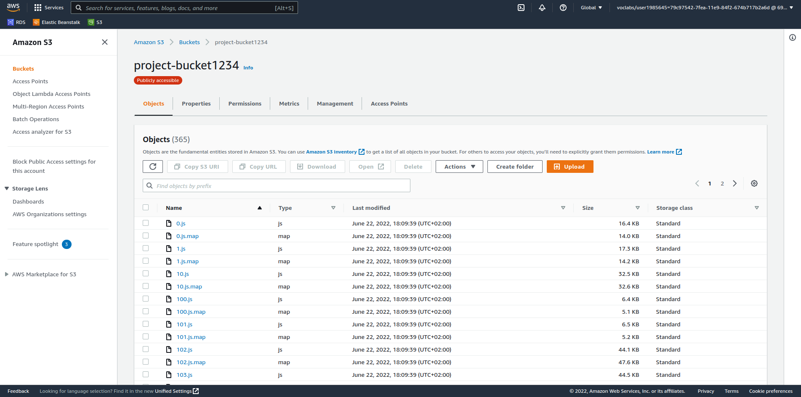
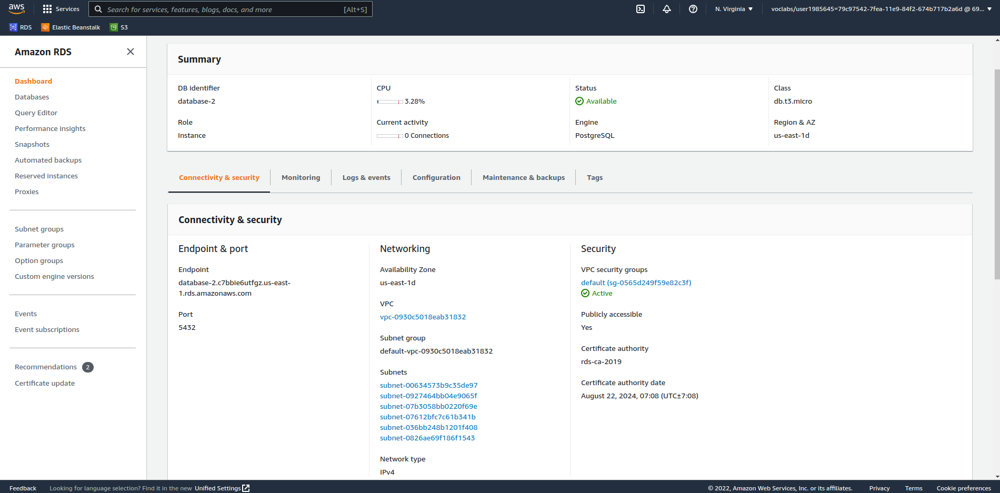

# Infrastructure

### Content
1. Web server
2. Front-End
3. Database
4. Users

## Web server
    creating a node.js Application -- EB instance -- for running server side for our project
    

## Front-End
    creating a bucket for front-end -- s3 -- to store and render the web pages

## Database
    creating a database instance -- Posgresql instance -- for running the database

## Users
    create a cli user for creating and deploying the project using terminal and grant permission for it & create user for creating services using console -- IAM --
